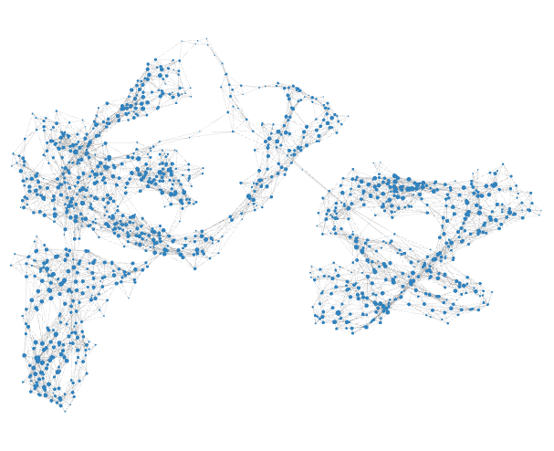

# sigmaNet

Render igraph networks using Sigma.js - in R!  

## Why?

Igraph is a great tool for working with networks in R, but it comes up short when creating visualizations.  Igraph uses R's plot() and a less-than-user-friendly set of parameters to create visualizations.  These visualizations are static and can be difficult to work with aesthetically.  For example, node sizes can be given with the vertex.size parameter, but they are then re-scaled by the plot() function behind the scenes.  Finally, plot() output is static and can only be rendered in image formats.

This package addresses these problems by allowing users to quickly create Sigma.js visualizations from igraph objects.  These visualizations render quickly, even with large numbers of nodes/edges, and allow for a number of different outputs: PNG, PDF, and interactive HTML.  

If you are only working with small networks, check out the visNetwork package which uses vis.js to draw networks.  The package has a lot of great features, but it is somewhat slow for large networks (10s of thousands of nodes) and can be sluggish once rendered.  This is because vis.js (and thus visNetwork) use canvas to render graphs.  Canvas is much faster than SVG-based graphics (like D3), but is slower than Webgl (used by Sigma.js).

## How?

First, install this package:

```
devtools::install_github('iankloo/sigmaNet')
```

Then, create an igraph network.  Here we'll use the sample "Karate" network from the igraphdata package.

Note, passing a layout to the sigmaNet() function will dramatically improve speed and allow you to focus on the asthetics (re-drawing will be much faster than re-learning a layout every time you change one little thing).

```
library(sigmaNet)
library(igraph)
library(igraphdata)

data(karate)
layout <- layout_with_fr(karate)

sigmaNet(karate, layout = layout)
```
<p>
    
</p>

If you render this at home, you'll see that you can zoom, pan, and get information on-hover for the nodes.

## Options

You have a few options available to change the aesthetics of graphs:

- minNodeSize and maxNodeSize adjust the scale of your nodes.  Sizing is assigned by degree (for now).
- minEdgeSize and maxEdgeSize act similar to the node attributes.  Sizing is done by weight, but the min- and max- attributes are both set as 1 by default, which ignores weighting.
- nodeColor and EdgeColor adjust colors...
- layout lets you bring your own layout to save rendering time (discussed above)

Note: there is no opacity/transparency/alpha attribute!  That is because webgl doesn't support transparency.  To mimic transparency, set your edge size to be small - this works really well.  I know this is a big tradeoff, but it is the only way to render large networks.  

Using some of these options to render a larger network:

```
data(immuno)

layout <- layout_with_fr(immuno)
sigmaNet(immuno, layout = layout,minNodeSize = .001, maxNodeSize = 3, minEdgeSize = .1, maxEdgeSize = .1)
```


As you can see, this graph still looks great even without transparency.  If you render this at home, you will see that the visualization is still snappy and responsive.  


## Features in development

- Shiny support
- Base node size on things other than degree
- Review original code base
- Add neighborhoods plugin
- Add filter plugin
- Options to control interactivity
- Export options


